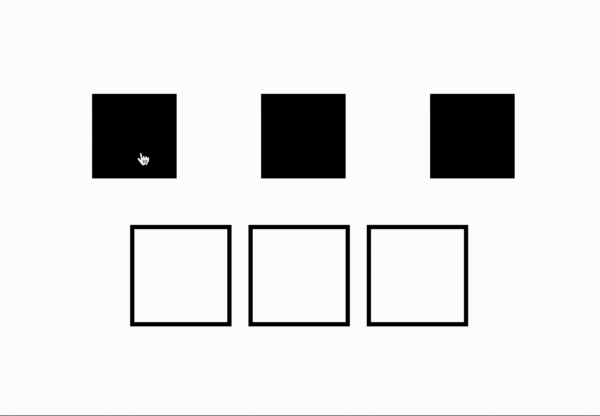

# Drag and Drop Out

Simple instantiation of the HTML5 drag and drop API



### Installing

In your project directory:

```
npm install drag-and-drop-out
```

### Usage (Module)

```
    <div>
        <div draggable="true" data-pairing-key='1'></div>
        <div draggable="true" data-pairing-key='2'></div>
        <div draggable="true" data-pairing-key='3'></div>
    </div>
    <div>
        <div class="drop-zone" data-pairing-key='1'>
        </div>
        <div class="drop-zone" data-pairing-key='2'>
        </div>
        <div class="drop-zone" data-pairing-key='3'>
        </div>
    </div>
```

In your project JS file:

```
import dnd from 'drag-and-drop-out'

/**
 * Initialize the drag and drop
 * @param {containerClass} <string> drop zone container class where you want to drop
 * elements
 */

import DnD from './index.js';

const dnd = new DnD('drop-zone');

dnd.init();

```
Use the attribute `data-pairing-key` if you want to lock a draggable element to a specific container:

```
<div draggable="true" data-pairing-key='1'></div>
<div class="drop-zone" data-pairing-key='1'></div>
```

Which means the drop zone will only accept draggable elements that have `data-pairing-key='1'`

### Usage (Standalone)

To generate standalone file `draganddropout.min.js`

```npm run build```

You can either upload to CDN or include it inline in your html with `<script></script>` tags. We can then initialize it on the window object with `window.DragAndDropOut.default.init();`. Refer to module usage for argument list.

## Running the tests

`npm run test`

## License

MIT